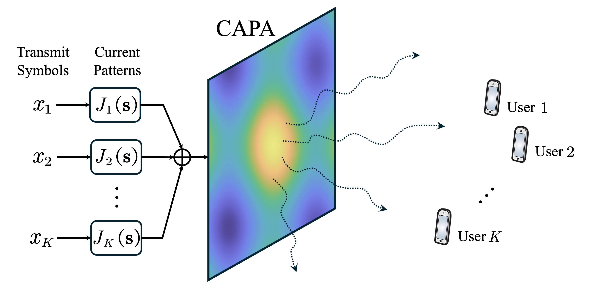
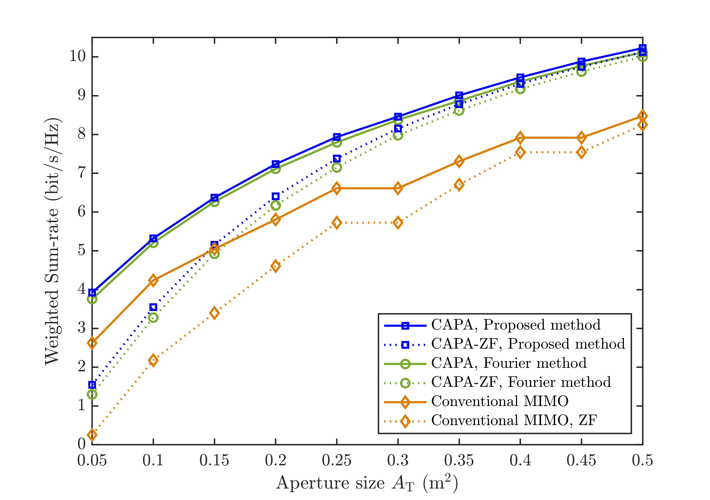

# Beamforming Optimization for Continuous Aperture Array (CAPA)-based Communications

The code for the paper **Z. Wang, C. Ouyang, and Y. Liu, “Beamforming Optimization for Continuous Aperture Array (CAPA)-based Communications,” *IEEE Trans. Wireless Commun.*, vol. 24, no. 6, pp. 5099-5113, Jun. 2025.** [[IEEE](https://ieeexplore.ieee.org/document/10910020)] [[Arxiv](https://arxiv.org/abs/2410.13677)]



Abstract: The beamforming optimization in continuous aperture array (CAPA)-based multi-user communications is studied. In contrast to conventional spatially discrete antenna arrays, CAPAs can exploit the full spatial degrees of freedom (DoFs) by emitting information-bearing electromagnetic (EM) waves through a continuous source current distributed across the aperture. Nevertheless, such an operation renders the beamforming optimization problem as a non-convex integral-based functional programming problem, which is challenging for conventional discrete optimization methods. A couple of low-complexity approaches are proposed to solve the functional programming problem. 1) *Calculus of variations (CoV)-based approach:* Closed-form structure of the optimal continuous source patterns is derived based on CoV, inspiring a low-complexity integral-free iterative algorithm for solving the functional programming problem. 2) *Correlation-based zero-forcing (Corr-ZF) approach:* Closed-form ZF source current patterns that completely eliminate the inter-user interference are derived based on the channel correlations. By using these patterns, the original functional programming problem is transformed into a simple power allocation problem, which can be solved using the classical water-filling approach with reduced complexity. Our numerical results validate the effectiveness of the proposed designs and reveal that: i) compared to the state-of-the-art Fourier-based discretization approach, the proposed CoV-based approach not only improves communication performance but also reduces computational complexity by up to hundreds of times for large CAPA apertures and high frequencies, and ii) the proposed Corr-ZF approach achieves asymptotically optimal performance compared to the CoV-based approach.


## Running the simulations

### Prerequisites

- [MATLAB](https://uk.mathworks.com/products/matlab.html)

### Launch

Run `main.m` for the main algorithms

Run `Figure_5.m` to plot Fig. 5 in this paper.

### Expected Results

#### Weighted sum-rate versus aperture size


## Citing
If you in any way use this code for research, please cite our original articles listed above. The corresponding BiBTeX citation is given below:
```
@article{wang2025capa,
  title={Beamforming Optimization for Continuous Aperture Array ({CAPA})-based Communications},
  author={Wang, Zhaolin and Ouyang, Chongjun and Liu, Yuanwei},
  journal={{IEEE} Trans. Wireless Commun.},
  year={2025},
  month=jun,
  volume={24},
  number={6},
  pages={5099-5113}
}

```

